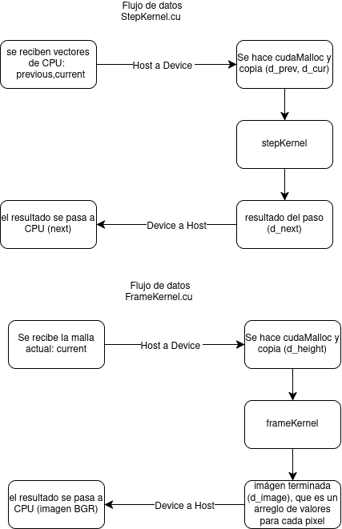

# Laboratorio Capítulo 3 


## 1. Descripción del programa base

Básicamente, el programa simula cómo se comportan las ondas producidas cuando cae una gota sobre la superficie del agua. Primero crea una malla que representa dicha superficie y reserva 3 arreglos de memoria para guardar los estados anterior, actual y siguiente. Luego genera una pequeña perturbación en el centro, que representa la gota.

A partir de ahí repite un ciclo 900 veces. En cada paso calcula el nuevo estado de la superficie a partir de los dos anteriores, lo que permite ver cómo se propagan las ondas con el paso del tiempo y cómo van perdiendo energía poco a poco. También aplica una especie de barrera en los bordes de la malla para reducir los rebotes de las ondas y evitar que interfieran con la simulación. Finalmente, convierte cada estado en una imagen y la agrega al video.

Al terminar, calcula el tiempo total y el rendimiento en pasos por segundo.

## 2. Diagrama de flujo

<p align="center">
  
</p>

## 3. Explicación de cada función

**`Config`:** agrupa los parámetros de tres categorías: formato de video (`width`, `height`, `seconds`, `fps`, `output`), física (`wave_speed`, `damping`, `edge_damping`) y gota (`drop_radius`, `drop_strength`). Se crea en `main` y se pasa como argumento a las funciones `add_drop`, `border_absorption`, `simulate_step` y `render_frame`.

**`index_of`:** convierte las coordenadas x e y en la posición correspondiente dentro del vector, para ubicar la celda.

**`add_drop`:** agrega una gota en el centro y genera un pulso para iniciar las ondas de la simulación.

**`border_absorption`:** calcula cuánto frenar la onda según la distancia a los bordes. Cerca del borde frena más, para que las ondas no reboten.

**`simulate_step`:** calcula el siguiente estado de la onda comparando cada celda con sus 4 vecinas y ajustando su altura, mediante la ecuación de onda bidimensional amortiguada:

```text
next = 2*current - previous + c²*laplaciano - damping*(current - previous)
laplaciano = izq + der + arriba + abajo - 4*centro
```

Usa dos `for` anidados para recorrer todas las celdas de la simulación, excepto los bordes. Calcula un solo paso de tiempo; `main` la llama en cada cuadro.

**`render_frame`:** crea una imagen en escala de grises a partir de la altura de la onda. En lugar de pintar la altura directamente, usa la inclinación de la superficie y una luz fija para que parezca agua.

**`main`:** prepara la simulación, genera sus cuadros y los guarda en un video. El ciclo se repite `cfg.seconds * cfg.fps` veces, es decir 900. Al final imprime el tiempo, los pasos simulados y el rendimiento en pasos por segundo.

## 4. Perfilado de la versión CPU 

### 4.1 Perfilado con perf 

#### Resultados de perf record

| Grupo | Funciones incluidas | % del tiempo |
|---|---|---:|
| Renderizado | `render_frame`, `cv::normalize`, `cv::norm`, `std::clamp`, `std::max`, operaciones de `cv::Vec` | ≈ 55,6 % |
| Potencia `powf` | `powf` de `libm` | 15,2 % |
| Absorción de bordes | `border_absorption`, `std::min(initializer_list)`, `std::__min_element` | ≈ 13,6 % |
| Actualización de la onda | `simulate_step` (stencil de 5 puntos) y acceso a los vectores | ≈ 5,8 % |
| Codificación de video | `libavcodec`, `libswscale` (usadas por `cv::VideoWriter`) | ≈ 6,7 % |
| Otros | inicialización, `memcpy`, kernel | ≈ 3 % |


#### Funciones más críticas

El perfilado indica que el programa dedica la mayor parte de su tiempo a renderizar cada cuadro. Aproximadamente el 55,6 % del tiempo de ejecución se utiliza en la función `render_frame`, así como las operaciones que esta llama para determinar la normal de la superficie en cada píxel. Las operaciones vectoriales, `std::max`, `std::clamp`, `cv::norm` y `cv::normalize` son ejemplos de estas últimas. La función `powf`, perteneciente a la biblioteca matemática, representa un 15,2 % más.

La segunda función esencial es la actualización de la malla, `simulate_step`, que emplea aproximadamente el 19,4 % en conjunto con `border_absorption`. Es notable que en ese grupo el cálculo del factor de absorción en los bordes (≈13,6 %) es más del doble que el stencil de la ecuación de onda (≈5,8 %). Esto se debe a que la distancia mínima a los cuatro bordes se calcula usando `std::min` sobre una lista de inicialización para cada celda y cada paso.

La codificación del video con OpenCV y FFmpeg (`libavcodec` y `libswscale`) representa apenas un 6,7 % del tiempo.

#### Porcentajes en el build optimizado

Los porcentajes mencionados previamente se derivan de un build compilado con `-fno-inline`, el cual facilita asignar tiempo a cada función, pero sobreestima el costo de funciones pequeñas auxiliares como `std::clamp` o `std::max`, dado que cada invocación tiene un costo. En el build optimizado sin esta bandera, el compilador incorpora la totalidad del cálculo en `main` (56,4 %), mientras que `powf` llega al 27 % del tiempo. Esto valida que calcular la potencia en punto flotante es una de las operaciones más costosas del programa.

### 4.2 Perfilado con Google Performance Tools 

#### Resultados deGoogle Performance Tools 

La segunda herramienta empleada fue Google Performance Tools (gperftools), la cual se conectó con `libprofiler` y se ejecutó utilizando la variable `CPUPROFILE`. Para la simulación completa (900 pasos) y para perf, se utilizó la misma configuración de compilación (`-O2 -g -fno-omit-frame-pointer -fno-inline`). El perfil se examinó utilizando `google-pprof --text`.

| Función | % propio | % acumulado |
|---|---:|---:|
| `render_frame` | 13,6 % | 56,3 % |
| `simulate_step` | 5,4 % | 19,0 % |
| `border_absorption` (llamada por `simulate_step`) | 3,5 % | 12,2 % |
| `powf` (con sus rutinas internas `exp2`, `log2`, `vrndn_f64`) | — | 15,5 % |

### 4.3 Comparación entre herramientas

| Grupo | perf | gperftools |
|---|---:|---:|
| Renderizado (`render_frame` y funciones que invoca) | ≈ 55,6 % | 56,3 % |
| Potencia `powf` | 15,2 % | 15,5 % |
| Absorción de bordes | ≈ 13,6 % | 12,2 % |
| Actualización de la onda (stencil) | ≈ 5,8 % | ≈ 6,8 % |
| Codificación de video (FFmpeg) | ≈ 6,7 % | ≈ 8,7 % |

Tanto el stencil de la ecuación de onda como la codificación del video tienen un peso menor que las otras herramientas, y estas dos últimas coinciden en que el renderizado es la parte más cara del programa, con `powf` y la absorción de bordes.

### 4.4 Función a portar primero a GPU

`render_frame` es la función que resulta más conveniente portar primero, ya que requiere mucho tiempo y su operación es independiente por píxel, cada uno de los píxeles de salida depende únicamente de su celda y de sus vecinos más cercanos, lo cual la convierte en perfecta para asignar un hilo de CUDA por cada píxel.

No obstante, portar únicamente una de las dos funciones limita el beneficio. La Ley de Amdahl establece que, si solo se lleva `simulate_step` (cerca del 19 %), el speedup máximo quedaría en 1/(1 − 0,19) ≈ 1,24x. En cambio, si se portan la actualización de la malla y el render simultáneamente, esto abarcaría aproximadamente el 90 % del tiempo y tendría un speedup teórico máximo próximo a 10x. Asimismo, si únicamente una de las dos funciones se llevara a cabo en la GPU, habría que duplicar la malla entre el sistema host y el dispositivo en cada etapa. Por eso se aconseja portar las dos, empezando por el render, y mantener la malla residente en la memoria de la GPU.


### 4.5 Funciones que no conviene portar

- **Escritura del video:** Utiliza solamente el 6,7 % del tiempo. Depende de las bibliotecas de FFmpeg y OpenCV que funcionan en la CPU, y el cuadro final tiene que estar en la memoria del host para ser entregado al `VideoWriter`.
- **Inicialización de la gota:** Se lleva a cabo una única vez y su coste es mínimo (inferior al 0,4 %).
- **Ciclo principal y configuración:**  son secuenciales, sin paralelismo que se pueda aprovechar.

## 5 Porteo a GPU

### 5.1 Justificación de las funciones portadas 

El perfilado de la versión CPU con perf y Google Performance Tools reveló que dos funciones acaparaban el tiempo de ejecución en su mayor parte:

| Función | Tiempo acumulado (gperftools) | Tiempo (perf) |
|---|---:|---:|
| `render_frame` (incluye las operaciones que invoca) | 56.3 % | ≈ 55.6 % |
| `simulate_step` (incluye `border_absorption`) | 19.0 % | ≈ 19.4 % |
| `powf` | 15.5 % | 15.2 % |

Tomando en cuenta las llamadas a `powf`, ambas funciones juntas representan aproximadamente el 90 % del tiempo de la versión de CPU. La Ley de Amdahl establece que si solo se porta `simulate_step`, el speedup máximo se limitaría a aproximadamente 1.24x (1 / (1 - 0.19)); en cambio, si ambas funciones son portadas, se puede alcanzar un speedup teórico cercano a 10x.

Asimismo, el libro del curso las clasifica como un problema *data parallel* (pág. 130), lo que quiere decir que son más aptas para la GPU:

- **`simulate_step`** calcula cada celda de la malla basándose en su valor anterior y en el de sus cuatro vecinos del paso anterior. El cálculo de una celda no está condicionado por el de las otras celdas del mismo paso, por ende, todas ellas tienen la capacidad de ser calculadas simultáneamente.
- **`render_frame`** determina el color de cada píxel, tomando como base la altura de su celda y la de sus celdas vecinas. Cada pixel es autónomo respecto a los demás.

El tamaño del problema también es apropiado, ya que la malla de 640 x 640 produce 409 600 hilos por kernel, lo cual es suficiente para mantener la GPU ocupada.

### 5.2 Diseño de los kernels CUDA
Se portaron a GPU las dos funciones que el perfilado identificó como más costosas: el renderizado de cada cuadro (render_frame) y la actualización de la ecuación de onda (simulate_step, junto con border_absorption). Ambas se implementaron como kernels: frameKernel y stepKernel y se llaman desde funciones wrapper (la funcion main del host) las cuales son declaradas con un extern "C" en un header sin tipos de CUDA, para que main.cpp se compile con el compilador de C++ y solo los archivos .cu pasen por nvcc.

El flujo de datos para esta primer implementación se puede observar en el siguiente diagrama:

<p align="center">
  
</p>

Para la paralelización, en ambos kernels se asigna un hilo por pixel (o celda de la malla). Cada hilo calcula sus coordenadas globales y ejecuta el calculo correspondiente. En este caso, la salida de cada hilo solo depende de los datos de entrada y se escriben en una posición exclusiva para cada hilo (es decir cada nilo escribe en una posicion de memoria asignada), por lo que no se requirió sincronizar los hilos. 

Respecto a la configuración de bloques e hilos, se usaron bloques de 16x16 hilos, definidos con la constante BLOCK_SIZE, así mismo, la cuadrícula se calcula con división entera redondeada hacia arriba  que cubrir toda la malla aunque sus dimensiones no sean múltiplos del bloque, los hilos sobrantes se descartan. Es importante hacer notar que el tamaño del bloque no se ajustó todavía, sino que queda como parámetro a explorar en la fase de optmización.

Respecto a los accesos a memoria, para el acceso a memoria se usó el acceso a memoria coalescente tanto para escrituras como para lecturas, sin embargo en esta versión no se usa memoria compartida, sino que los vecinos se leen directamente de memoria global.

También se tuvieron que reescribir algunas funciones que no estaban disponibles en CUDA pero que si existían en GPU, a continuación se hace una tabla de resúmen:

| Versión CPU | Versión CUDA |
|---|---|
| `cv::Vec3f`, `cv::normalize`, `.dot()` | Componentes `float` sueltas y `rsqrtf` (se calcula `1/√(x²+y²+z²)` una vez y se multiplica) |
| `std::max`, `std::min`, `std::clamp` | `max`, `min` (enteros), `fmaxf`, `fminf` y la función `clampf` |
| `std::pow` | `powf` |
| `border_absorption` (con `std::min` de lista de inicialización) | Cálculo en línea con `min(min(x, y), min(ancho-1-x, alto-1-y))` |
| `image.at<cv::Vec3b>` | Escritura en un arreglo de `uchar3`, que ocupa 3 bytes igual que un píxel `CV_8UC3` |

### 5.3 Resultados de la GPU base

| Métrica | CPU base | GPU base |
|---|---:|---:|
| Tiempo total (promedio de 3 corridas) | 110.00 s | 47.52 s |
| Pasos por segundo | 8.18 | 18.94 |
| Speedup respecto a CPU | 1.00x | 2.31x |

La manera en que se distribuye el tiempo es ilustrada por el perfil de la GPU base con `nvprof`:

| Operación | Llamadas | Tiempo |
|---|---:|---:|
| `frameKernel` | 900 | 7.210 s |
| `stepKernel` | 900 | 3.212 s |
| Copias host-device | 2700 | 4.589 s |
| Copias device-host | 1800 | 2.415 s |
| `cudaMemcpy` (API) | 4500 | 22.17 s |
| `cudaMalloc` (API) | 4500 | 6.12 s |
| `cudaFree` (API) | 4500 | 1.44 s |

En comparación con la CPU, la GPU base consigue un speedup de 2.31x, lo cual es un resultado poco significativo teniendo en cuenta el grado de paralelismo del problema. La razón es explicada por el perfil: ambos kernels suman 10.42 segundos, mientras que la CPU tarda aproximadamente 30 segundos esperando las llamadas de gestión de memoria y copias. En otras palabras, la mayor parte del tiempo se ocupa de mover datos entre la GPU y la CPU y de reservar memoria en cada paso, no de hacer cálculos.

## 6. Estrategia de validación CPU vs GPU

### 6.1 Estrategia de validación

### 6.2 Resultados de la GPU base


## 7. Optimizaciones

### 7.1 Optimización 1: Memoria compartida con tiling y halo 

#### Problema que intenta resolver


El kernel de la línea base, que utiliza un stencil de 5 puntos, computa el laplaciano. Esto significa que cada valor de "current" se lee desde la memoria global hasta cinco veces: una vez como centro y cuatro veces como vecino de las celdas contiguas. El perfilado con `nvprof` de la línea base reveló que había 1 224 962 transacciones globales de lectura por paso, con una ocupación del 86 % y un rendimiento del 85,75 %. La hipótesis era que, debido a que el acceso ya se había coalesced y la ocupación era elevada, la redundancia en las lecturas restringía el rendimiento del kernel.


#### Cambio realizado

Únicamente se alteró `src/stepKernel.cu`. El kernel `stepKernel` fue sustituido por `stepKernelShared`.

- Cada bloque de 16 × 16 hilos declara en la memoria compartida un tile de 18 × 18 floats (el bloque más un halo a cada lado que equivale al rango del stencil de cinco puntos).
- Todos los hilos copian la celda de `current` al tile, y los hilos que están en el borde del bloque también copian la celda vecina que se encuentra fuera de él.
- Se garantiza que el tile esté completo antes de realizar los cálculos mediante una barrera `__syncthreads()`.
- Para calcular el laplaciano, se examinan los vecinos a partir del tile y se realizan las mismas operaciones que en la línea base, en el mismo orden.

#### Evidencia de perfilado 

El perfilado con `nvprof` de la GPU base reveló que el kernel de la onda, `stepKernel`, tomaba 3.57 ms en promedio por llamada, lo cual es un periodo largo para una malla de 640 × 640. Para determinar la causa, se calcularon las métricas de acceso a memoria del kernel:

| Métrica (`stepKernel`, GPU base) | Valor |
|---|---:|
| `gld_transactions` | 1 224 962 |
| `gld_efficiency` | 85.75 % |
| `achieved_occupancy` | 86.3 % |

El hecho de que la eficiencia de carga fuera del 85.75 % señalaba que el acceso a memoria global ya estaba coalesced, por lo cual no era necesario modificar el patrón de acceso. El hecho de que la ocupación fuera del 86.3 % indicaba que la GPU ya estaba bien utilizada en términos de hilos activos. El número de transacciones de lectura, no obstante, era mucho mayor al que se necesitaba, ya que para leer `current` y `previous` una vez es necesario alrededor de 102 400 transacciones de 32 bytes, pero el kernel hacía 1 224 962 por paso. Esto se debe a que el stencil de 5 puntos analiza cada valor de `current` hasta cinco veces: una vez como centro y cuatro veces como vecino de las celdas vecinas.

Se propuso la hipótesis de que el kernel estaba restringido por el acceso a memoria, y que si cada sección de la malla se cargara una vez en la memoria compartida, disminuiría tanto el tráfico como el tiempo del kernel.

#### Resultados

Mediciones en la Jetson Nano, con el mismo tamaño de bloque (16 × 16) que la línea base.

| Métrica | Línea base | Memoria compartida |
|---|---:|---:|
| Tiempo total (promedio de 3 corridas) | 47.52 s | 48.71 s |
| Pasos por segundo | 18.94 | 18.48 |
| Speedup respecto a CPU (110 s) | 2.31x | 2.26x |
| Speedup respecto a la versión anterior | — | 0.976x |
| Tiempo total del kernel de la onda (900 llamadas) | 3.212 s | 4.294 s |
| Tiempo promedio por llamada del kernel de la onda | 3.569 ms | 4.772 ms |
| Tiempo total del kernel de render (900 llamadas) | 7.210 s | 7.210 s |
| Tiempo de copias host→device | 4.589 s | 4.589 s |
| Tiempo de copias device→host | 2.415 s | 2.415 s |
| Transacciones de lectura en L2 | 356 765 | 159 447 |
| Instrucciones ejecutadas | 921 600 | 1 241 600 |
| Esperas por `__syncthreads()` | 0 % | 14.87 % |
| Error absoluto máximo respecto a CPU | 5.91e-5 | 5.91e-5 |
| Error relativo máximo respecto a CPU | 1.6e-5 | 1.6e-5 |

**Resultado:** la optimización empeoró el rendimiento. El kernel de la onda fue un 33,7 % más lento (de 3,569 ms a 4,772 ms por llamada) y el tiempo total aumentó un 2,5 % (de 47,52 s a 48,71 s), lo que corresponde a un speedup de 0,976x respecto a la línea base GPU. El aumento del tiempo total (1,19 s) se explica casi por completo por el kernel (1,08 s más en las 900 llamadas), ya que las copias y el render no cambiaron.

La memoria compartida disminuyó en un 55 % el tráfico a la caché L2; sin embargo, el kernel resultó ser un 33.7 % más lento debido a que ejecuta un 34.7 % más de instrucciones (carga del halo, sincronización, índices y escrituras al tile). Como el kernel original no tiene limitaciones de memoria, este ajuste no mejora la eficiencia.

Se llevó a cabo un experimento adicional en el que se utilizaron bloques de 32 × 8. Estos eliminaron los conflictos entre bancos de la versión de 16 × 16 (las transacciones de memoria compartida disminuyeron exactamente a la mitad), sin embargo, no hubo una mejora significativa del kernel, que solo aumentó en un 3,8 %.

#### Validación e impacto en la precisión numérica

Al comparar con la línea base GPU a través de `compare_dumps`, los resultados son exactamente iguales en cada bit: error 0 tanto en las alturas como en los cuadros, en los siete cuadros analizados. Esto es porque el kernel ejecuta las mismas operaciones en el mismo orden, pero la única variación es la procedencia de los datos. Por ende, en la precisión numérica no se ve afectada la optimización, y su error con respecto a la CPU es igual al de la línea base (según la validación del Ejercicio E, el máximo error absoluto es de 5.91e-5 y el máximo error relativo es de 1.6e-5).

### 7.2 Optimización 2: reducción de comunicación host-device 

#### Problema que intenta resolver

El libro, en la primera parte de la sección 3.4 (pág. 129), advierte que, para un algoritmo de GPU, el trabajo a realizar debe ser más abundante que los datos transferidos para evitar estar subiendo y bajando información entre la GPU y la CPU de manera continua. La línea base, por el contrario, reservaba tres buffers en la GPU en cada etapa de simulación; transfería `previous` y `current` del host al dispositivo; ejecutaba el kernel; devolvía `next` al host y liberaba la memoria. El render seguía el mismo modelo en cada cuadro, con la imagen y la malla. 

Se corroboró el inconveniente a partir del perfilado de la línea base con `nvprof`: 2700 copias host-device, 1800 copias device-host y 4500 llamadas a `cudaMalloc` y `cudaFree` se registraron en 900 cuadros. Los tiempos de estas llamadas en la API de CUDA (22.17 s en `cudaMemcpy`, 6.12 s en `cudaMalloc` y 1.44 s en `cudaFree`) eran mucho mayores que el tiempo total de los dos kernels (10.42 s). Se planteó la hipótesis de que, aunque los kernels no se modificaran, conservar los datos en la unidad de procesamiento gráfico (GPU) disminuiría el tiempo total.

#### Cambio realizado

**Reutilización de los buffers (pág. 138).** El libro sugiere la idea de reservar los buffers solo una vez y volver a utilizarlos en todas las iteraciones, en vez de reservarlos y liberarlos cada vez. En `src/frameKernel.cu` y `src/stepKernel.cu`, se declaran como variables estáticas los punteros a la memoria de la GPU, y solamente en la primera llamada (`if (... == nullptr)`) se reserva la memoria, además, se borraron todas las instancias de `cudaFree` que había dentro del ciclo.

**Residencia de los datos (páginas 137-138).** El libro detalla la técnica de pasar los datos a la GPU una vez, enlazar múltiples operaciones dentro de ella y solo transferir el resultado. En esta edición:

- En la primera llamada de `gpu_step`, únicamente se copian las mallas iniciales a la GPU.
- El render y el paso de simulación funcionan sobre los mismos datos en la GPU, tal como lo hacen las operaciones sucesivas de la ecuación 3.24. En vez de recibir la malla copiada desde el host, el kernel de render toma la malla directamente de la memoria de la GPU.
- La única transferencia por cuadro es la imagen final, que es el único dato requerido por la CPU para el `VideoWriter`. Esto se adhiere a la sugerencia de la sección "Memoria del host y transferencias" (pág. 142), que aconseja reducir la frecuencia con la que se realizan las transferencias.

Para poder realizar estos cambios se añadieron tres componentes:

- En vez de duplicar el resultado en el host, se hace un intercambio entre los punteros a las tres mallas (`d_prev - d_cur`, `d_cur - d_next`). Esto consiste en implementar la residencia de datos en una simulación de múltiples fases, y reproducir en la GPU la rotación que previamente realizaba main.cpp con los vectores.
- gpu_current_device(): Facilita la conexión entre el render y la malla actual en la GPU, aunque se encuentren en archivos distintos.
- gpu_copy_to_host: Copia la malla al host únicamente en los cuadros que se emplean para validar el ejercicio E, ya que el vector `current` del host no se actualiza en cada iteración. 

#### Evidencia de perfilado

El perfil general de la GPU base, que se logró mediante `nvprof` a partir de una simulación completa de 900 cuadros, reveló que el coste de gestionar la memoria y comunicar entre la CPU y la GPU era superior al de los kernels en sí:

| Operación (GPU base) | Llamadas | Tiempo |
|---|---:|---:|
| Copias host→device (en la GPU) | 2700 | 4.59 s |
| Copias device→host (en la GPU) | 1800 | 2.42 s |
| `cudaMemcpy` (API) | 4500 | 22.17 s |
| `cudaMalloc` (API) | 4500 | 6.12 s |
| `cudaFree` (API) | 4500 | 1.44 s |
| `stepKernel` + `frameKernel` | 1800 | 10.42 s |

El patrón del código fue revelado por el conteo de llamadas, se reservaban tres buffers en cada paso de simulación, dos mallas eran copiadas al dispositivo y una regresaba al host; se liberaba la memoria, y el render realizaba el mismo procedimiento en cada cuadro con la imagen y la malla. En total, la CPU dedicaba aproximadamente 30 segundos a esperar llamadas de gestión de memoria y de copia, en comparación con los 10.42 segundos que tomaba ejecutar los kernels.

Asimismo, cada copia de una malla de 1.6 MB requería alrededor de 1.7 ms, lo que representa menos de 1 GB/s. Esto demostró que, aunque la Jetson Nano comparte su memoria física entre la GPU y la CPU, las transferencias explícitas todavía representan un costo significativo.

Se propuso, basándose en esta evidencia, la hipótesis de que el cuello de botella de la GPU base no estaba en el cálculo, sino en la transferencia de datos. Además, se planteó que conservar las mallas dentro de la GPU durante toda la simulación disminuiría el tiempo total, aunque los kernels permanecieran iguales.


#### Resultados

Mediciones en la Jetson Nano.

| Métrica | Línea base | Reducción host-device |
|---|---:|---:|
| Tiempo total (promedio de 3 corridas) | 47.52 s | 31.41 s |
| Pasos por segundo | 18.94 | 28.65 |
| Speedup respecto a CPU (110 s) | 2.31x | 3.50x |
| Speedup respecto a la versión anterior | — | 1.51x |
| Tiempo total del kernel de la onda (900 llamadas) | 3.212 s | 3.211 s |
| Tiempo total del kernel de render (900 llamadas) | 7.210 s | 7.211 s |
| Copias host-device | 2700 llamadas, 4.589 s | 2 llamadas, 0.003 s |
| Copias device-host | 1800 llamadas, 2.415 s | 900 llamadas, 1.037 s |
| Llamadas a `cudaMalloc` | 4500 (6.121 s) | 4 (0.470 s) |
| Llamadas a `cudaFree` | 4500 (1.441 s) | 0 |
| Error absoluto máximo respecto a CPU | 5.91e-5 | 5.91e-5 |
| Error relativo máximo respecto a CPU | 1.6e-5 | 1.6e-5 |

**Resultado:** El funcionamiento mejoró gracias a la optimización. El tiempo total disminuyó de 47.52 s a 31.41 s (−33.9 %), lo que equivale a un speedup del 1.51x en comparación con la línea base GPU y del 3.50x en comparación con la CPU.

El libro describe la duración de una ejecución en GPU como la suma del lanzamiento, las transferencias, el kernel y la sincronización. Esta optimización disminuye el término de las transferencias, conservando el del kernel: los tiempos de `stepKernel` y `frameKernel` son iguales a los de la línea base, y la mejora se debe completamente a la administración de memoria y la comunicación. Además, la CPU dedicaba la mayor parte de su tiempo a esperar las llamadas para gestionar la memoria y comunicarse:
| Llamada a la API | Línea base | Reducción host-device | Ahorro |
|---|---:|---:|---:|
| `cudaMemcpy` | 22.17 s | 13.04 s | 9.13 s |
| `cudaMalloc` | 6.12 s | 0.47 s | 5.65 s |
| `cudaFree` | 1.44 s | 0 s | 1.44 s |
| **Total** | | | **16.22 s** |

La disminución del tiempo total (16.11 s) es igual al ahorro total en la API (16.22 s). La memoria del host convencional no puede utilizarse directamente para realizar transferencias eficientes, por lo tanto, como el driver primero tiene que mover los datos hacia un buffer intermedio cuando se copian desde la memoria paginable, este gasto por parte de la CPU se eliminó junto con las copias. Por ello, el ahorro en "cudaMemcpy" es superior al tiempo que se reduce en las copias realizadas en la GPU. Los 13.04 segundos que quedan en `cudaMemcpy` son, sobre todo, tiempo de espera, ya que, como la copia de la imagen es sincrónica, se debe esperar a que acaben los dos kernels de cada cuadro. 


#### Validación e impacto en la precisión numérica

Los resultados son exactamente iguales a los de la línea base de GPU, tal como se ha verificado con `compare_dumps`: error 0 en las alturas y en los cuadros, para cada uno de los siete cuadros examinados. Esto se explica porque los kernels efectúan exactamente las mismas operaciones, solo varía el sitio donde se almacenan los datos entre pasos. La residencia de los datos no altera ningún cálculo, por lo que no existe una compensación entre rapidez y precisión, en contraste con las optimizaciones de matemática aproximada o de precisión reducida que se explican en el libro (páginas 158-166). Conforme a la validación del ejercicio E, el error relacionado con la CPU es el mismo que el de la línea base: un error absoluto máximo de 5.91e-5 y un error relativo máximo de 1.6e-5.

### 7.3 Optimización 3: uso de `--use_fast_math`

Versión de la GPU en la que el código CUDA se compila con la opción `--use_fast_math` de `nvcc`. El código fuente (`main.cpp`, `stepKernel` y `frameKernel`) es **idéntico** al de la línea base GPU (`gpu_baseline/`); lo único que cambia es la forma de compilar los archivos `.cu`.

#### Problema que intenta resolver

La sección más costosa de la GPU base es el kernel de render (`frameKernel`): requiere 8.01 ms por llamada, lo que representa más del doble que el tiempo del kernel de la simulación (3.57 ms). Para cada píxel, calcula una normal aproximada, así como una componente difusa y otra especular; la última se calcula usando `powf(diffuse, 24.0f)`. Una multiplicación o una suma son mucho más baratas que las operaciones matemáticas como la división, la raíz cuadrada o la potencia, ya que estas últimas se ejecutan como una serie de instrucciones con el propósito de asegurar su exactitud (pág. 159 del libro del curso).

En la página 161, el libro explica la opción `--use_fast_math` de `nvcc`, que sustituye estas operaciones por versiones aproximadas más económicas. Además de otras modificaciones, `powf` comienza a utilizar la versión intrínseca `__powf`, que hace uso de las unidades de funciones especiales (SFU) de la GPU. Asimismo, ya no se realizan divisiones y raíces cuadradas con precisión completa. El propósito de esta optimización es disminuir el tiempo de los kernels a expensas de una pequeña parte de la precisión, en línea con el principio del libro que indica no emplear más precisión de la requerida (pág. 166).


#### Cambio realizado 

Se agregó `--use_fast_math` a los argumentos de `nvcc` del ejecutable en `meson.build`:

```meson
executable(
  'drop_simulation',
  [ 'src/main.cpp', 'src/frameKernel.cu', 'src/stepKernel.cu' ],
  cuda_args: ['--use_fast_math'],
  dependencies: opencv,
  install: false,
)
```

#### Evidencia de perfilado 

**Perfilado de la versión CPU.** Según perf, `powf` era una de las funciones más costosas del programa, ya que utilizaba el 15.2 % del tiempo; según gperftools, ocupaba el 15.5 %. En la construcción optimizada sin `-fno-inline`, este porcentaje se elevaba hasta el 27 %. Esta función se utiliza para calcular la parte especular del render, que se realiza una vez por cada cuadro y cada píxel.

**Perfilado de la GPU base.** El perfil con `nvprof` indica que el kernel principal en la versión GPU es todavía el render:

| Kernel (GPU base) | Llamadas | Tiempo total | Tiempo por llamada | % de la actividad de la GPU |
|---|---:|---:|---:|---:|
| `frameKernel` | 900 | 7.210 s | 8.01 ms | 41.4 % |
| `stepKernel` | 900 | 3.212 s | 3.57 ms | 18.4 % |


#### Resultados

Mediciones en la Jetson Nano con `nvprof`, 900 cuadros. Los valores de la línea base son los de su corrida de `nvprof` sin la opción.

| Métrica | Línea base | `--use_fast_math` | Cambio |
|---|---:|---:|---:|
| Tiempo por llamada de `frameKernel` | 8.0115 ms | 5.9288 ms | −26.0 % (1.35x) |
| Tiempo total de `frameKernel` (900 llamadas) | 7.210 s | 5.336 s | −1.874 s |
| Tiempo por llamada de `stepKernel` | 3.5690 ms | 3.5678 ms | ≈ 0 |
| Tiempo total de `stepKernel` (900 llamadas) | 3.212 s | 3.211 s | ≈ 0 |
| Tiempo total de los dos kernels | 10.42 s | 8.55 s | −18.0 % (1.22x) |
| Copias host-device | 2700 llamadas, 4.589 s | 2700 llamadas, 4.585 s | ≈ 0 |
| Copias device-host | 1800 llamadas, 2.415 s | 1800 llamadas, 2.415 s | ≈ 0 |
| `cudaMemcpy` (API) | 22.17 s | 20.02 s | −2.16 s |
| `cudaMalloc` (API) | 6.12 s | 6.03 s | −0.09 s |
| `cudaFree` (API) | 1.44 s | 1.37 s | −0.07 s |
| Error absoluto máximo respecto a CPU (alturas) | 5.91e-5 | 5.91e-5 | igual |
| Error relativo máximo respecto a CPU (alturas) | 1.6e-5 | 1.4e-5 | igual (mismo orden) |
| Diferencia máxima respecto a CPU (cuadros) | 1 nivel de gris | 1 nivel de gris | igual |
| Tiempo total | 47.52 s (promedio de 3 corridas) | 46.79 s (1 corrida, con `nvprof`)* | −0.73 s |
| Pasos por segundo | 18.94 | 19.24* | |
| Speedup respecto a CPU (110 s) | 2.31x | 2.35x* | |
| Speedup respecto a la versión anterior | — | 1.02x* | |

**Resultado:** el tiempo del kernel de render bajó un 26 %, de 8.01 ms a 5.93 ms por llamada, mientras que el kernel de paso quedó igual. Esto confirma la hipótesis: la mejora se concentra en el kernel que usa `powf`, y `stepKernel` actúa como control, ya que su tiempo cambió solo un 0.03 %. Las copias, las reservas de memoria y el resto de las llamadas a la API no cambiaron de forma apreciable.

Como el tiempo del kernel de render es muy estable entre llamadas (entre su mínimo y su máximo hay menos de 0.7 %), la mejora de 26 % está muy por encima de la variación de una llamada a otra.

El ahorro en los kernels es de 1.88 s. Si el resto del tiempo no cambia, equivale a un ahorro del ~4 % sobre los 47.52 s de la línea base, es decir, un speedup esperado de ≈ 1.04x. Esto es un cálculo a partir de los tiempos de los kernels y no una medición del total. El ahorro en `cudaMemcpy` (2.16 s) es del mismo orden que el de los kernels porque las copias son sincrónicas: la llamada espera a que terminen los kernels, y por eso el tiempo de ejecución de estos aparece también dentro de ella.

La mejora es modesta porque los kernels son una fracción menor del tiempo total. Como el libro describe, la duración de una ejecución en GPU es la suma del lanzamiento, las transferencias, el kernel y la sincronización; esta optimización reduce solo el término del kernel de render, y los demás términos (en la línea base dominados por las transferencias y las reservas de memoria) quedan intactos.

Esta optimización es complementaria a la reducción de comunicación host-device. Si se combinaran, los kernels representarían una fracción mayor del tiempo (10.42 s de los 31.41 s de la versión con residencia de datos), y el ahorro de 1.88 s correspondería a un ~6 % (speedup esperado ≈ 1.06x). Es una estimación a partir de los tiempos individuales; no está medida.

#### Validación e impacto en la precisión numérica 

La opción `--use_fast_math` sí cambia el resultado numérico, a diferencia de la reducción de comunicación host-device, que dio resultados idénticos. Se comparó contra la CPU con `compare_dumps` en siete cuadros; el resultado global fue **PASS**.

#### Malla de alturas (float32) respecto a la CPU

| Cuadro | MAE | RMSE | max\|err\| | max\|ref\| | Error relativo al pico | Posición (x,y) |
|---|---|---|---|---|---|---|
| 0 | 2.1e-12 | 4.2e-10 | 1.19e-7 | 2.339 | 5.1e-8 | (305,327) |
| 1 | 4.4e-12 | 7.3e-10 | 2.38e-7 | 3.668 | 6.5e-8 | (305,327) |
| 10 | 4.1e-10 | 1.8e-8 | 2.86e-6 | 14.88 | 1.9e-7 | (307,300) |
| 100 | 2.4e-7 | 1.8e-6 | 5.91e-5 | 21.04 | 2.8e-6 | (314,311) |
| 300 | 9.5e-7 | 2.8e-6 | 3.05e-5 | 6.387 | 4.8e-6 | (319,380) |
| 600 | 2.3e-6 | 3.7e-6 | 1.98e-5 | 1.973 | 1.0e-5 | (307,375) |
| 899 | 4.4e-6 | 5.6e-6 | 1.73e-5 | 1.198 | 1.4e-5 | (300,252) |

#### Cuadros (escala de grises) respecto a la CPU

| Cuadro | MAE | Dif. máx. | Píxeles distintos | Píxeles con dif. > 1 | PSNR (dB) |
|---|---|---|---|---|---|
| 0 | 0 | 0 | 0 % | 0 % | inf |
| 1 | 0 | 0 | 0 % | 0 % | inf |
| 10 | 0 | 0 | 0 % | 0 % | inf |
| 100 | 3.9e-5 | 1 | 0.0039 % (16 px) | 0 % | 92.2 |
| 300 | 1.6e-4 | 1 | 0.0161 % (66 px) | 0 % | 86.1 |
| 600 | 2.7e-4 | 1 | 0.0266 % (109 px) | 0 % | 83.9 |
| 899 | 3.4e-4 | 1 | 0.0344 % (141 px) | 0 % | 82.8 |

Los conteos de píxeles son sobre 409 600 (640×640).

- **El costo en precisión es prácticamente nulo.** El error relativo máximo de las alturas es de 1.4e-5, unas 7 veces por debajo de la tolerancia de 1e-4, y el error absoluto máximo (5.91e-5, en el cuadro 100) es el mismo que el de la línea base. En los cuadros, la diferencia máxima sigue siendo de 1 nivel de gris y ningún píxel difiere en más de 1.
- **Los errores son del mismo orden que los de la línea base, con variaciones en ambos sentidos.** Respecto a la línea base, el error de las alturas es idéntico hasta el cuadro 100 y cambia ligeramente desde el 300 (por ejemplo, MAE en el cuadro 600: 2.22e-6 → 2.31e-6; error máximo en el cuadro 899: 1.88e-5 → 1.73e-5), y el número de píxeles distintos pasa de 68 a 66 (cuadro 300), de 105 a 109 (600) y de 152 a 141 (899). No hay un empeoramiento sistemático; lo que cambia es el patrón del redondeo acumulado.
- **El resultado ya no es idéntico bit a bit a la línea base.** Eso confirma que la opción modificó el código generado, y es coherente con el cambio de las funciones aproximadas, la división y el vaciado de denormales (`--ftz`). No se verificó a nivel de instrucciones cuál de estos factores causa las diferencias de las alturas.
- **Compromiso entre precisión y velocidad.** Se obtuvo una mejora del 26 % en el kernel de render a cambio de errores que quedan dentro de la tolerancia y son del mismo orden que los de la línea base. En este problema el compromiso es favorable, porque la salida es una imagen de 8 bits: las diferencias de coma flotante casi nunca alcanzan a cambiar un píxel (solo el 0.03 % de los píxeles cambia, y en un único nivel de gris).

## 8. Resumen de resultados

### 8.1 Tabla comparativa

| Versión | Tiempo total | Pasos/s | Speedup | Error máximo |
|---|---:|---:|---:|---:|
| CPU base | 110.00 s | 8.18 | 1.00x | — (referencia) |
| GPU base | 47.52 s | 18.94 | 2.31x | 5.91e-5 |
| Optimización 1: memoria compartida | 48.71 s | 18.48 | 2.26x | 5.91e-5 |
| Optimización 2: reducción host-device | 31.41 s | 28.65 | 3.50x | 5.91e-5 |
| Optimización 3: `--use_fast_math` | 46.79 s* | 19.24* | 2.35x* | 5.91e-5 |


Se calcula el speedup en relación con la CPU base. Los tiempos de las versiones GPU se obtuvieron al promediar tres pruebas en la Jetson Nano, sin profiler. El error absoluto máximo de la malla de alturas en relación a la CPU, que se obtiene utilizando `compare_dumps`, es el error máximo.

La optimización 2 se implementó en la GPU base, no en la primera optimización, porque esta última no logró mejorar el rendimiento y fue descartada.

Detalle de tiempos por versión, obtenido con `nvprof`:

| Versión | `stepKernel` | `frameKernel` | Copias H-D | Copias D-H | Speedup vs versión anterior |
|---|---:|---:|---:|---:|---:|
| GPU base | 3.212 s | 7.210 s | 4.589 s (2700) | 2.415 s (1800) | — |
| Optimización 1: memoria compartida | 4.294 s | 7.210 s | 4.589 s (2700) | 2.415 s (1800) | 0.976x |
| Optimización 2: reducción host-device | 3.211 s | 7.211 s | 0.003 s (2) | 1.037 s (900) | 1.51x |
| Optimización 3: `--use_fast_math` | 3.211 s | 5.336 s | 4.585 s (2700) | 2.415 s (1800) | 1.02x* |


El número de copias se señala entre paréntesis. El speedup de la optimización 2 se determina en relación con la GPU base.

### 8.2 Salidas relevantes de nvprof

#### GPU base

Comunicación y gestión de memoria en cada paso de simulación (`nvprof_baseline.txt`):

```text
            Type  Time(%)      Time     Calls       Avg  Name
 GPU activities:   41.38%  7.21036s       900  8.0115ms  frameKernel(...)
                   26.33%  4.58856s      2700  1.6995ms  [CUDA memcpy HtoD]
                   18.43%  3.21214s       900  3.5690ms  stepKernel(...)
                   13.86%  2.41515s      1800  1.3417ms  [CUDA memcpy DtoH]
      API calls:   73.89%  22.1741s      4500  4.9276ms  cudaMemcpy
                   20.40%  6.12111s      4500  1.3602ms  cudaMalloc
                    4.80%  1.44103s      4500  320.23us  cudaFree
```

Métricas del kernel de la onda (`nvprof_metrics_baseline.txt` y `nvprof_cache_baseline.txt`):

```text
Kernel: stepKernel
    gld_transactions        1224962
    gld_efficiency           85.75%
    achieved_occupancy     0.863404
    l2_read_transactions     356765
    inst_executed            921600
    stall_sync                0.00%
```

#### Optimización 1: memoria compartida

Tiempo del kernel (`nvprof_shared.txt`):

```text
 GPU activities:   23.20%  4.29431s       900  4.7715ms  stepKernelShared(...)
```

Métricas del kernel con memoria compartida (`nvprof_metrics_shared.txt` y `nvprof_cache_shared.txt`):

```text
Kernel: stepKernelShared
    gld_transactions             633602
    gld_efficiency               72.32%
    shared_load_transactions     127600
    achieved_occupancy         0.915796
    l2_read_transactions         159447
    inst_executed               1241600
    stall_sync                   14.87%
```

#### Optimización 2: reducción de comunicación host-device

Comunicación después de la optimización (`nvprof_host_device.txt`):

```text
            Type  Time(%)      Time     Calls       Avg  Name
 GPU activities:   62.92%  7.21108s       900  8.0123ms  frameKernel(...)
                   28.01%  3.21067s       900  3.5674ms  stepKernel(...)
                    9.05%  1.03678s       900  1.1520ms  [CUDA memcpy DtoH]
                    0.03%  3.0585ms         2  1.5293ms  [CUDA memcpy HtoD]
      API calls:   94.87%  13.0436s       902  14.461ms  cudaMemcpy
                    3.42%  469.71ms         4  117.43ms  cudaMalloc
                    1.71%  235.09ms      1800  130.61us  cudaLaunchKernel
```


Los archivos completos se encuentran dentro de la carpeta `results/` en cada una de las optimizaciones realizadas.


## 9. Análisis de rendimiento 

## 10. Conclusiones 

## 11. Nota sobre utilización de herramientas de IA

Se hace uso de herramientas de IA como apoyo para comprender conceptos, generar ideas y mejorar la redacción de la documentación. La implementación, la validación y los resultados son responsabilidad del estudiante, quien asume la responsabilidad por el uso indebido o no descrito anteriormente.

Se adjuntan los enlaces compartidos de las conversaciones como evidencia:

- https://share.gemini.google/MZ4nmLKV4dKc
- https://chatgpt.com/share/6ac84f6e-a9f0-83e8-a1cf-d3643a9d31d0
