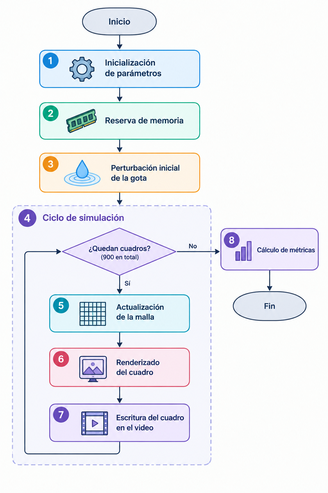

# Drop Simulation
NOTA: esta version esta modificada para correr en la jetson.

Prototipo CPU en C++ y OpenCV para simular la caida de una gota sobre un estanque
usando una ecuacion de onda 2D amortiguada.

El objetivo es que esta version sea la referencia inicial del laboratorio antes de
portar el calculo principal a GPU y aplicar optimizaciones como coalescing,
shared memory, matematica aproximada y precision de 16 bits.

## Compilar

En la Jetson hay que usar g++ 8, porque g++ 7 no soporta `<filesystem>`:

```bash
CXX=g++-8 CC=gcc-8 meson setup build
meson compile -C build
```

## Ejecutar

```bash
./build/drop_simulation_cpu
```

Por defecto genera:

```text
output/drop_simulation.mp4
```

## Parametros actuales

```text
width             640
height            640
seconds           30
fps               30
steps_per_frame   1
wave_speed        0.45
damping           0.006
edge_damping      0.035
drop_radius       18
drop_strength     1.0
output            output/drop_simulation.mp4
```

Estos valores estan definidos en `src/main.cpp`, dentro de `Config`.

## Idea fisica

Cada celda guarda la altura de la superficie del agua. La actualizacion usa un
stencil de 5 puntos:

```text
laplaciano = izquierda + derecha + arriba + abajo - 4 * centro

h_next = 2 * h_current - h_previous
         + c^2 * dt^2 * laplaciano
         - damping * (h_current - h_previous)
```

Para visualizar, se calculan normales aproximadas con diferencias finitas y se
aplica iluminacion simple. Esto produce un efecto de agua sin requerir un motor
3D.

## Ejercicio A: ejecución del código base

### Entorno

| Componente | Versión |
|---|---|
| Plataforma | NVIDIA Jetson Nano |
| CUDA | 10.2 |
| OpenCV | 4.1.1 |
| Compilador | g++ 8.4.0 |

### Línea base CPU

Cinco ejecuciones del programa sin modificar. Cada una simula 900 pasos y genera
un video de 640 x 640, 30 s a 30 FPS.

| Corrida | Tiempo (s) | Pasos/s |
|---|---|---|
| run_01 | 108.835 | 8.269 |
| run_02 | 108.711 | 8.279 |
| run_03 | 108.790 | 8.273 |
| run_04 | 108.427 | 8.301 |
| run_05 | 108.384 | 8.304 |

**Mediana: 108.711 s / 8.279 pasos/s.** Este es el valor de referencia para
calcular el speedup de las versiones GPU.

Los logs están en `results/cpu-base/`.

## Ejercicio B: comprensión del código

Cada función de `src/main.cpp` está comentada con su propósito y su papel
dentro de la simulación.

### Diagrama de flujo



### Descripción del programa

Básicamente, el programa simula cómo se comportan las ondas producidas cuando cae
una gota sobre la superficie del agua. Primero crea una malla que representa dicha
superficie y reserva 3 arreglos de memoria para guardar los estados anterior,
actual y siguiente. Luego genera una pequeña perturbación en el centro, que
representa la gota.

A partir de ahí repite un ciclo 900 veces. En cada paso calcula el nuevo estado de
la superficie a partir de los dos anteriores, lo que permite ver cómo se propagan
las ondas con el paso del tiempo y cómo van perdiendo energía poco a poco. También
aplica una especie de barrera en los bordes de la malla para reducir los rebotes de
las ondas y evitar que interfieran con la simulación. Finalmente, convierte cada
estado en una imagen y la agrega al video.

Al terminar, calcula el tiempo total y el rendimiento en pasos por segundo.

## Uso de IA
https://share.gemini.google/MZ4nmLKV4dKc

https://chatgpt.com/share/6ac84f6e-a9f0-83e8-a1cf-d3643a9d31d0

